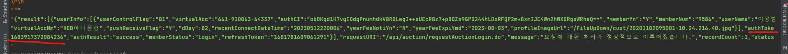

### Usage:
```bash
$ # with php (Recomended)
$ php get_token.php "<username>" "<password>"
```
### Result:


### Info:
```
ARIA key: myXyzfamily-aria-password
```

### Request:
```
# url
https://auction.autobell.co.kr/api/auction/requestAuctionLogin.do?
# type
    loginType=TOTAL
# auth data
    &userId=<ARIA256>
    &userPassword=<BASE64->ARIA256>
# misc
    &flagOtpAuth=
    &smsAuthNumber=
    &authToken=
    &tokenType=
```
